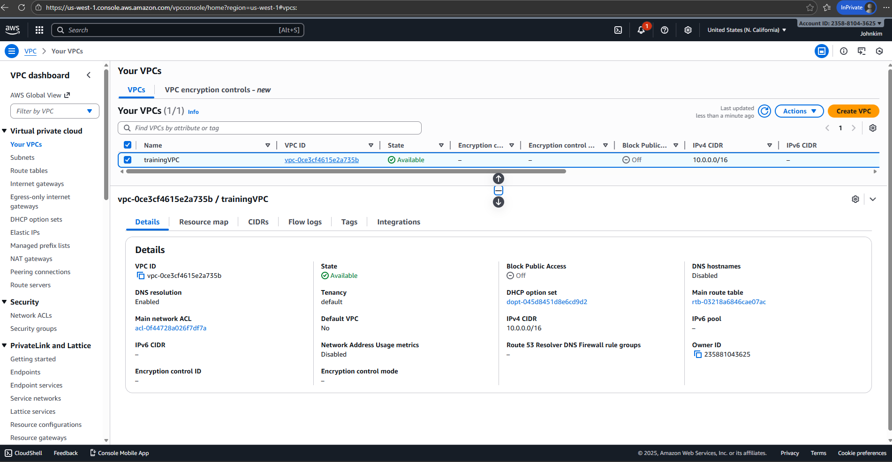
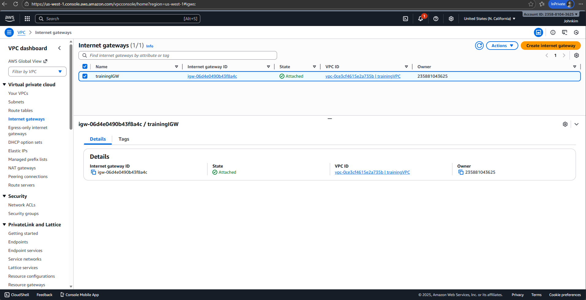
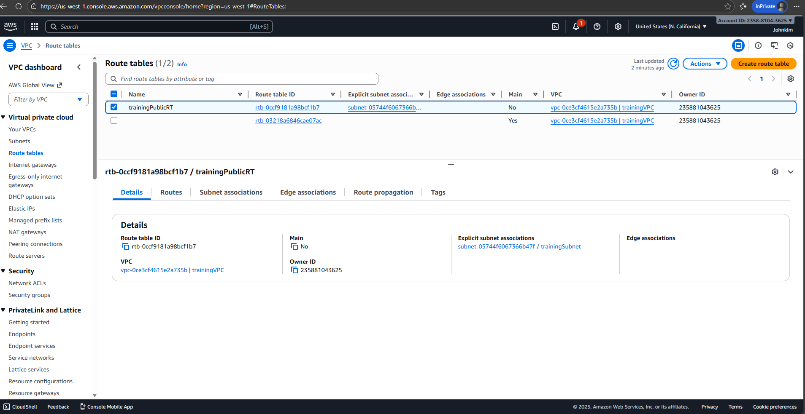
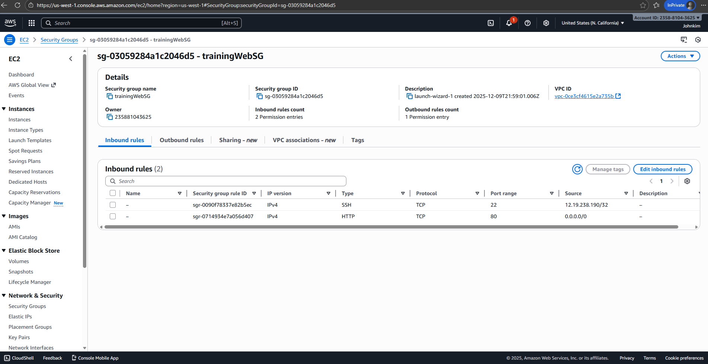
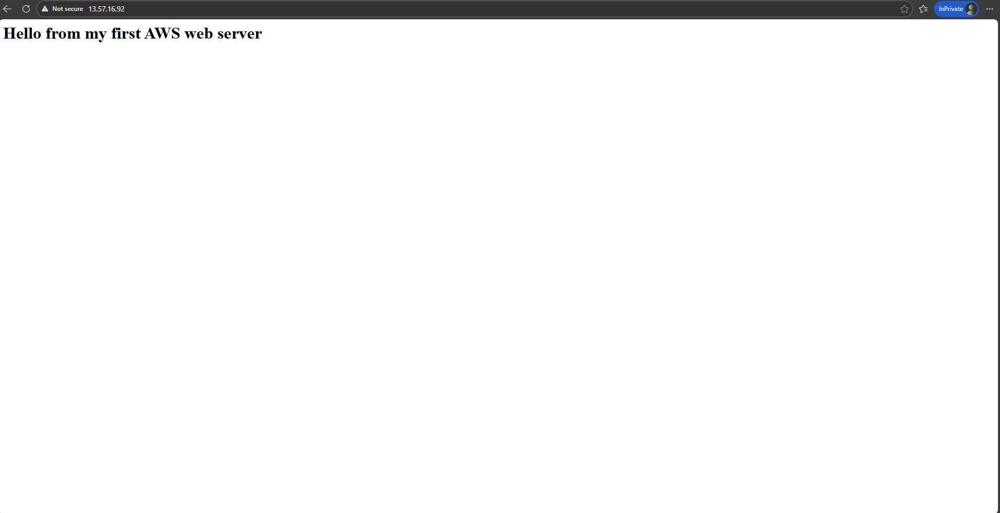

# Project #1 — AWS VPC + Public Subnet + EC2 Web Server

This project demonstrates how to deploy a basic web server running on an EC2 instance inside a custom VPC with a public subnet.  
It covers the essential cloud networking components used in real Cloud Support / Cloud Operations roles.

---

## 📌 Architecture Diagram

Internet
|
[ Internet Gateway ]
|
[VPC: 10.0.0.0/16]
|
[ Public Subnet: 10.0.1.0/24 ]
|
[ EC2 Web Server (Amazon Linux) ]
- Public IP: 13.57.16.92
- Security Group:
- SSH (22) from My IP
- HTTP (80) from 0.0.0.0/0

markdown
Copy code

---

## 📌 Components Used

| Component | Description |
|----------|-------------|
| **VPC (10.0.0.0/16)** | Custom virtual private network |
| **Public Subnet (10.0.1.0/24)** | Subnet with route to Internet Gateway |
| **Internet Gateway** | Enables internet access for EC2 |
| **Route Table** | Routes 0.0.0.0/0 → IGW |
| **EC2 Instance** | Amazon Linux web server |
| **Security Group** | Allows HTTP (80) & SSH (22) |
| **Apache (httpd)** | Web server software |

---

## 📌 Deployment Steps

### 1. Create VPC 
- CIDR: `10.0.0.0/16`
- Name: `trainingVPC`

### 2. Create Public Subnet 
- CIDR: `10.0.1.0/24`
- Name: `public-subnet-1`
- Select any AZ

### 3. Create & Attach Internet Gateway 
- Name: `training-igw`
- Attach to VPC

### 4. Route Table 
- Add route:  
  `0.0.0.0/0 → Internet Gateway`
- Associate with public-subnet-1

### 5. Launch EC2 Instance  
- Amazon Linux 2023 / Amazon Linux 2
- Instance type: `t2.micro`
- Subnet: public-subnet-1
- Auto-assign public IP: Enabled
- Security Group: 
  - SSH (22) → My IP
  - HTTP (80) → 0.0.0.0/0

### 6. Install Apache Web Server 
```bash
sudo dnf update -y
sudo dnf install -y httpd
sudo systemctl enable httpd
sudo systemctl start httpd
7. Create test webpage
bash
Copy code
echo "<h1>Hello from my first AWS web server</h1>" | sudo tee /var/www/html/index.html
8. Test
Browser →
http://13.57.16.92

You should see:

Hello from my first AWS web server

📌 Screenshots
(Upload the following screenshots into a folder named /screenshots and reference them here.)

Recommended screenshots:

VPC list showing trainingVPC

Subnet list showing public-subnet-1

Route Table showing 0.0.0.0/0 → igw

Internet Gateway attached

EC2 instance page with public IP

Security Group inbound rules

Browser screenshot of working webpage

Example:

bash
Copy code
/screenshots
    vpc.png
    subnet.png
    route-table.png
    igw.png
    ec2-instance.png
    sg-rules.png
    browser.png
📌 Troubleshooting Notes
Common issues and real-world debugging steps:

1. Browser can't connect
Security Group missing port 80

Apache service not running

Wrong public IP

Route table not associated with subnet

2. SSH not working
Port 22 not open to your IP

Wrong key permissions

Wrong username (should be ec2-user)

3. Webpage not updating
Cached browser

File not created in /var/www/html/index.html

✅ Result
This project demonstrates:

✔ How to build foundational AWS network components
✔ How to deploy a functioning EC2 web server
✔ Understanding of routing, security, and public subnet configuration
✔ Skills directly used in real Cloud Support / Cloud Ops roles

END OF README
